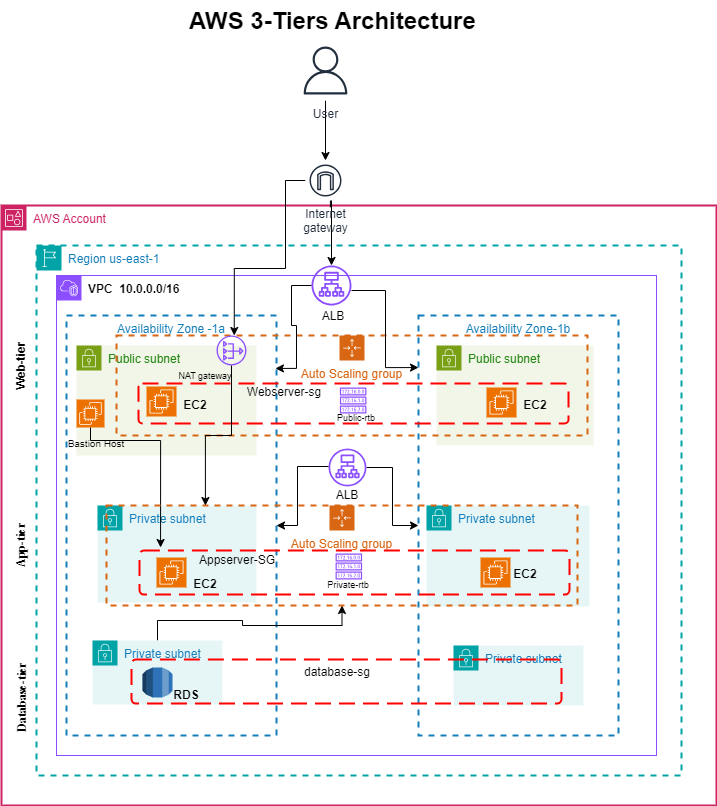

# aws-3-tier-project

# AWS 3-Tier Architecture

Ce projet décrit la mise en place d'une architecture 3 tiers sur AWS pour héberger une application web. Cette architecture est conçue pour fournir une haute disponibilité, une scalabilité et une sécurité renforcée.

## Structure de l'Architecture

L'image ci-dessous montre la représentation de l'architecture 3-Tiers sur AWS :

L'architecture est divisée en trois couches principales :

1. **Web Tier**
2. **App Tier**
3. **Database Tier**

Chaque couche est distribuée sur deux zones de disponibilité (Availability Zones) pour assurer la haute disponibilité.

### 1. Web Tier

- **VPC** : Le réseau virtuel dans lequel tous les composants AWS sont déployés.
- **Internet Gateway** : Permet aux instances EC2 dans les sous-réseaux publics d'accéder à Internet.
- **Application Load Balancer (ALB)** : Répartit le trafic entrant vers les instances EC2 de la couche Web.
- **Auto Scaling Group (ASG) pour les Web Servers** : Assure la scalabilité et la redondance des serveurs web.
- **Instances EC2** : Hébergent le serveur web (Apache/Nginx) dans des sous-réseaux publics.
- **Bastion Host** : Instance EC2 dans un sous-réseau public qui permet un accès SSH sécurisé aux serveurs de l'App Tier.

### 2. App Tier

- **ALB (Interne)** : Répartit le trafic entre les serveurs d'application dans la couche App Tier.
- **Auto Scaling Group (ASG) pour les App Servers** : Maintient le nombre d'instances EC2 nécessaires pour supporter la charge.
- **Instances EC2** : Hébergent les serveurs d'application dans des sous-réseaux privés sécurisés.

### 3. Database Tier

- **Amazon RDS (Relational Database Service)** : Fournit une base de données relationnelle gérée dans des sous-réseaux privés. Les instances RDS ne sont accessibles que depuis les instances de l'App Tier.

## Sécurité

- **Security Groups** : Contrôlent le trafic entrant et sortant pour chaque couche de l'architecture.
  - `Webserver-sg` : Autorise uniquement le trafic HTTP/HTTPS entrant de l'Internet et le trafic SSH depuis le Bastion Host.
  - `Appserver-sg` : Autorise uniquement le trafic HTTP/HTTPS entrant depuis le Web Tier.
  - `Database-sg` : Autorise uniquement le trafic entrant depuis l'App Tier sur le port de la base de données (généralement 3306 pour MySQL).

- **NAT Gateway** : Permet aux instances dans les sous-réseaux privés d'accéder à Internet pour télécharger des mises à jour et des correctifs de sécurité.

## Déploiement

Pour déployer cette architecture, vous pouvez utiliser des outils d'infrastructure as code tels que **Terraform** ou **AWS CloudFormation**. Assurez-vous de configurer correctement les sous-réseaux, les tables de routage, les groupes de sécurité et les autoscaling groups pour assurer la sécurité, la redondance et la scalabilité.

## Conclusion

Cette architecture 3-Tiers sur AWS est idéale pour les applications web nécessitant une haute disponibilité, une scalabilité dynamique et une sécurité renforcée. Les composants sont répartis sur plusieurs zones de disponibilité pour une tolérance aux pannes et une continuité de service.

