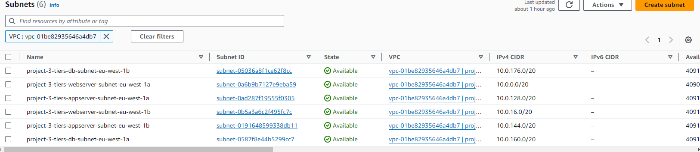
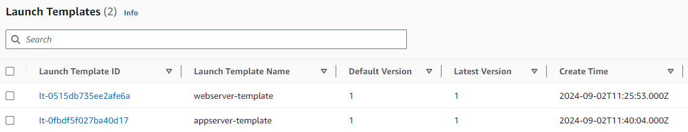
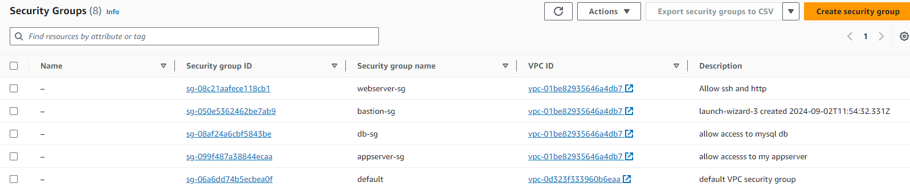
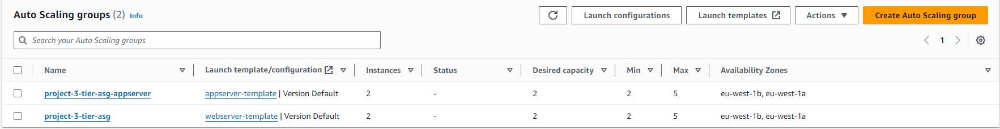
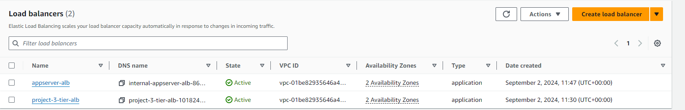
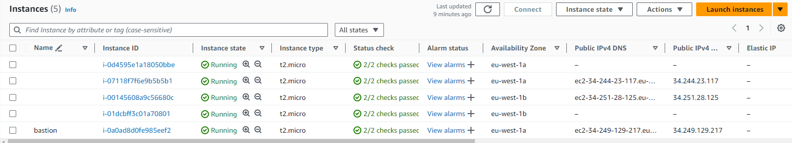
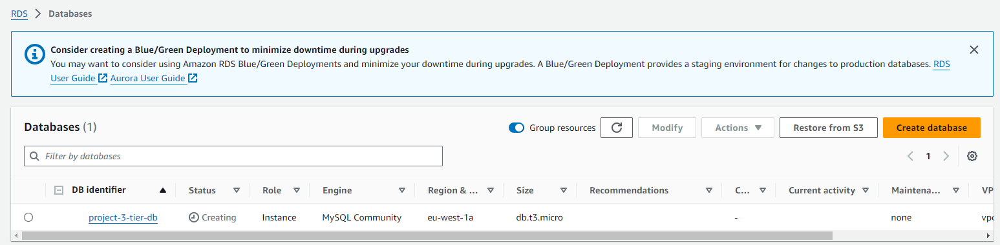
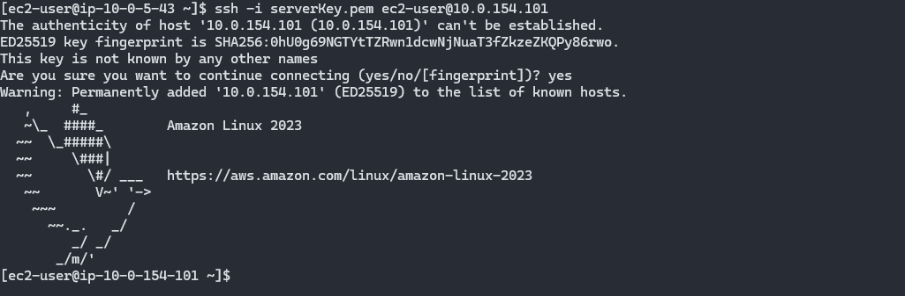
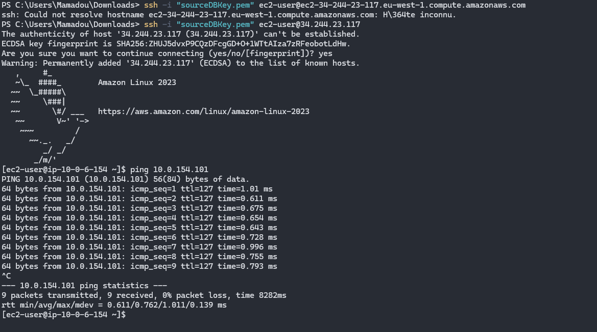

# Documentation de Création des Ressources AWS

Ce document fournit des instructions étape par étape pour créer les différentes ressources nécessaires à la mise en place de l'architecture AWS 3-Tiers, avec des captures d'écran pour chaque étape.

## Table des Matières

1. [Configuration du VPC](#création-du-vpc)
2. [Création des Launch Template](#création-du-launch-template)
3. [Configuration des Security Groups](#configuration-des-security-groups)
4. [Création de l'Auto Scaling Group (ASG)](#création-de-lauto-scaling-group-asg)
5. [Application Load Balancer (ALB)](#mise-en-place-de-lapplication-load-balancer-alb)
6. [Instances EC2](#création-des-instances-ec2)
7. [Création de l'Instance RDS](#création-de-linstance-rds)
8. [Connexion SSH depuis le Bastion Host](#connexion-ssh-depuis-le-bastion-host)
9. [Test de Connectivité avec Ping](#test-de-connectivité-avec-ping)

## Configuration du VPC

1. Allez dans le service **VPC** dans la console AWS.
2. Cliquez sur **Create VPC** et configurez le CIDR Block, le nom, etc.
3. Capture d'écran de la configuration du VPC :

   

## Création du Launch Template

1. Allez dans **Launch Templates** dans le service EC2.
2. Cliquez sur **Create Launch Template** et remplissez les détails requis.
3. Capture d'écran de la création du Launch Template :

   

## Configuration des Security Groups

1. Accédez à **Security Groups** dans la console AWS VPC.
2. Créez des Security Groups pour les différentes couches de l'architecture (Web, App, Database).
3. Capture d'écran de la configuration des Security Groups :

   

## Création de l'Auto Scaling Group (ASG)

1. Allez dans **Auto Scaling Groups** sous le service EC2.
2. Cliquez sur **Create Auto Scaling Group** et utilisez le Launch Template précédemment créé.
3. Capture d'écran de la configuration de l'ASG :

   

## Mise en place de l'Application Load Balancer (ALB)

1. Accédez à **Load Balancers** dans le service EC2.
2. Capture d'écran de la création de l'ALB :

   

##  Instances EC2

1. Accédez au service **EC2**.
2. Capture d'écran de la configuration des instances EC2 :

   

## Création de l'Instance RDS

1. Accédez à **RDS** dans la console AWS.
2. Cliquez sur **Create Database** et suivez les étapes de configuration.
3. Capture d'écran de la création de l'instance RDS :

   

## Connexion SSH depuis le Bastion Host

1. Connectez-vous à l'instance Bastion Host via SSH.
2. Utilisez la connexion bastion pour accéder aux instances privées de l'App Tier.
3. Capture d'écran de la connexion SSH depuis le Bastion Host :

   

## Test de Connectivité avec Ping

1. Utilisez la commande `ping` pour tester la connectivité entre les différentes couches.
2. Assurez-vous que les Security Groups permettent la communication entre les ressources.
3. Capture d'écran du test de connectivité avec `ping` :

   

## Conclusion

Ce document fournit un guide complet pour la création et la configuration des ressources AWS nécessaires pour mettre en place une architecture 3-Tiers. Chaque section est accompagnée de captures d'écran pour vous guider tout au long du processus.

